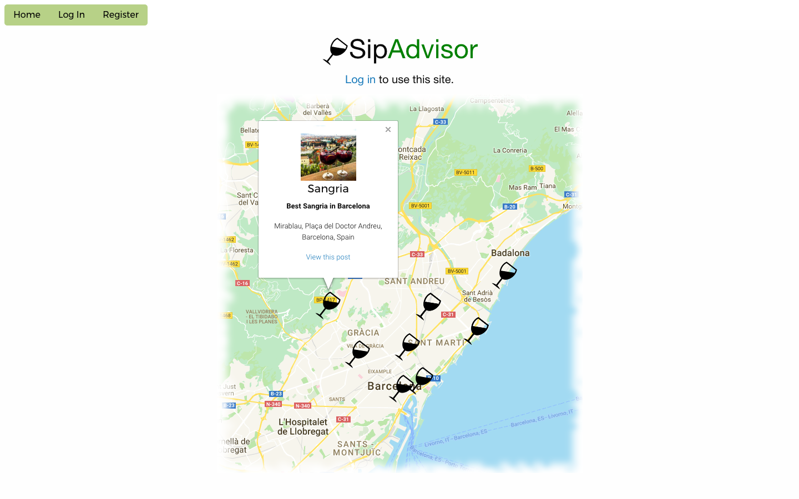
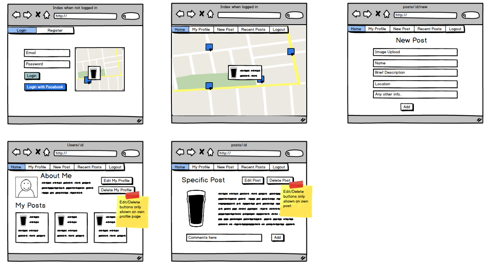
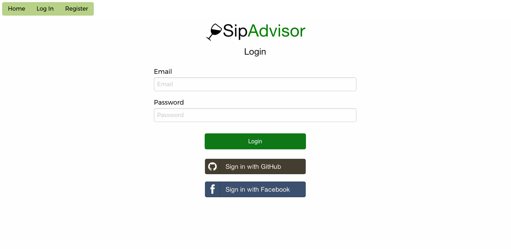
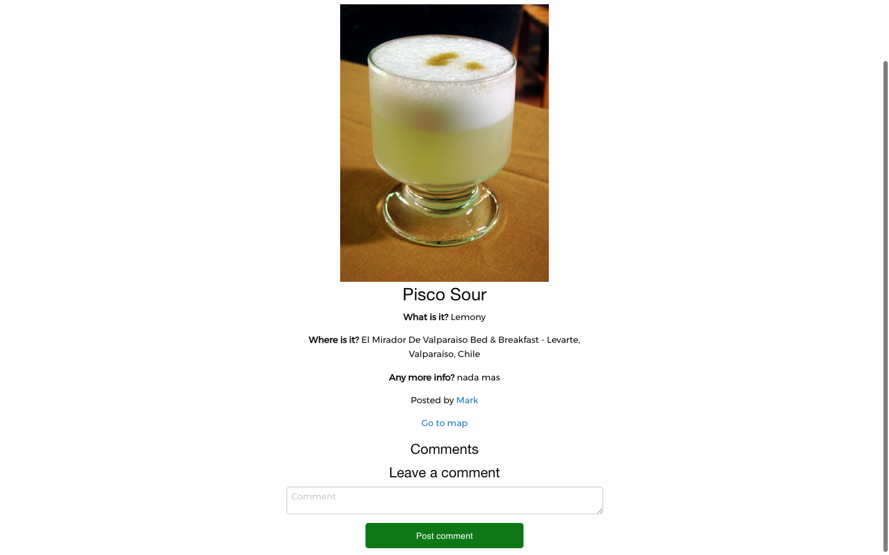

##GA WDI 25 London - Project 2

#SipAdvisor

######A RESTful app with Google Maps API integration

In the second project of the Web Development Immersive course we were tasked with designing and building a full-stack RESTful application with authentication and an authorisation flow. I was keen to develop an app which would build on the previous weeks of learning whilst also providing me with a challenge.

####The result is... SipAdvisor ([click to use app](https://sip-advisor.herokuapp.com/))

###User Interaction

* The app is designed for use by travellers who enjoy trying local drinks in the countries they travel to.
* Users can register in the usual way, or simply sign in using their GitHub or FaceBook account.
* Logged-in users are able to post photos of the drinks they try, along with a few other details including the location of where the drink can be bought.
* The location co-ordinates are used to plot the drink posts on a map.
* The map is loaded at login and users are shown their current location, allowing them to easily discover other user's drink postings nearby.

***

###Wire Framing

***

###How It Works

The app has two main models - Users and Drinks. It also has an embedded Google Map with user's posts plotted in appropriate locations.

Users need to sign in to the website in order to access, or post to, the Drinks database. They can register for a standard account and use those details to login, or login using GitHub or Facebook credentials. Only standard accounts are able to update their profile username and email address, as well as include a short bio on their profile page. GitHub and Facebook only import a username and profile image. All users have an option to delete their profile.

All logged-in users can post drinks to the database. They are required to post an image, the name, location, and a brief description. The location is selected from a Google Places autocomplete search box which also stores the location's longitude and latitude in 2 separate, hidden input fields.

Once a user has made a post, they will see the post has been added to the Drip-feed, a full directory of all posts by all users. They can also see all of their own posts displayed underneath their profile info on their personal profile page. Clicking the name of the post on either of those pages takes the user to the show page for that specific drink.

On the homepage, the embedded Google Maps has a geolocator which is activated as the map loads, showing the user their current location. All drink postings are shown with stylised markers. The markers have click listeners with infowindows attached, which show a summary of the drink posting and a link to the drink show page.

Drink show pages contain all details about the drink, including the name of the user who created the posting and a link to that user's profile page. If the user created the posting themselves, there are 2 buttons to edit or delete the post. There is also an option to see comments about the drink left by other users, create your own comments, and delete your own comments.

####The Build

* HTML 5, CSS and jQuery were used to create the webpages.
* NodeJS Express, Mongo and Mongoose ORM were used to create the databases.
* Multer was used for controlling image uploads to AWS S3.
* The Google Maps API was used to store and plot locations on the embedded map.
* The Google Web Font 'Montserrat' was used to style the text.

###Problems & Challenges

The major challenge of this project was the ability store the location of each post and to plot it on the map. To overcome this, a Google Places autocomplete search box was included as a field within the 'add drink' form. Two hidden forms were also created, one for the longitude, another for the latitude.

A function inside an event listener on the location search box was implemented to extract the long/lat data from the location and store it in the hidden fields. Then an each loop was used to loop through all drinks in the database and plot them as markers on the map. Sounds simple in writing but it was quite complex to set up when using a Google Maps API for the first time.

###Future Improvements

I would like to make the following improvements to this app...

* Responsiveness - the app works on all screen sizes, but some adjustments are needed to improve the use of the navbar and map scroll on smaller screens
* User accounts - I would like to include options to update user passwords.
* Image upload - A little work is needed to allow users to change their profile images.
* Confirm deletion - allow users to confirm they want to delete their comment/post/profile before actually deleting it.
